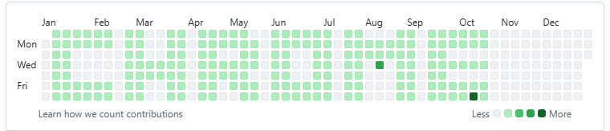

# 🎨 GitHub Heatmap Art - CHROME

Create the word "CHROME" on your GitHub contribution heatmap using backdated commits.



## 🚀 Quick Start

```powershell
# 1. Configure Git with your GitHub email
git config user.email "your-github-email@example.com"

# 2. Run the script
.\make_commits.ps1

# 3. Push to GitHub
git push origin main
```

## 📁 Files

- **`make_commits.ps1`** - Main script (creates light green pattern)
- **`make_dark_commits.ps1`** - Creates darker green pattern (10x commits)
- **`chrome-dates.txt`** - Date layout grid for the CHROME pattern
- **`preview_heatmap.ps1`** - Preview the pattern before committing
- **`heatmap_preview.html`** - Web preview of the heatmap

## ⚙️ How It Works

1. Script creates 200+ commits backdated to 2024
2. Each commit adds a comment to `index.html`
3. GitHub shows green squares on those dates
4. Pattern spells "CHROME" across your contribution graph

## 🎯 Options

- **Light Green**: Run `make_commits.ps1` once
- **Dark Green**: Use `make_dark_commits.ps1` 
- **Preview First**: Run `preview_heatmap.ps1` to see the pattern

## � Reset

If you want to undo:
```powershell
git reset --hard [commit-before-script]
git push --force-with-lease origin main
```

**That's it!** Your 2024 GitHub heatmap will show "CHROME" in green squares. 🎨